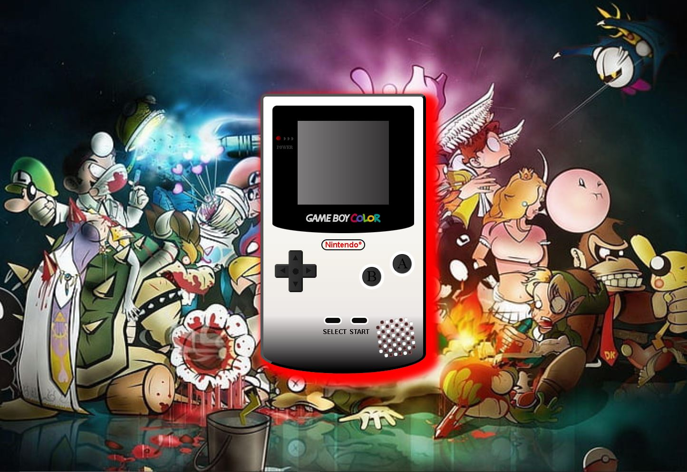
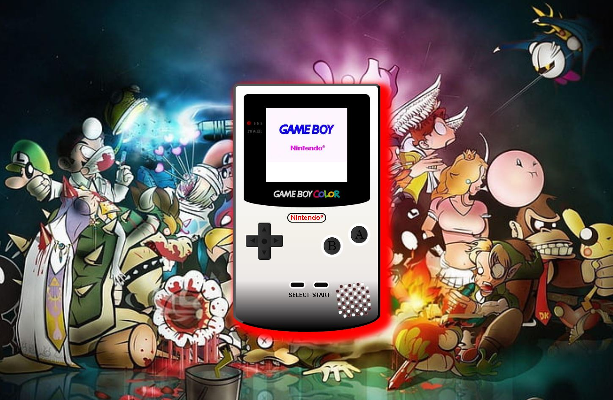

---
**Índice**
- [Proyecto 👾](#qué-es)
- [Manejo 🪄](#proyecto)
- [Lanzamiento 🚀](#lanzamiento)
- [Sección de errores 💣](#sección-de-errores)
- [Tecnologías ⚙️](#tecnologías)
- [Créditos 📜](#créditos)
---

### Proyecto

El segundo proyecto realizado para el curso de Full Stack Developer de GeeksHubs Academy. 
Una reproducción de la Game Boy Color, diseñada con HTML y Css. Con algunas funciones como el encendido de la consola y la interactuación con algunos botones. 

---

### Manejo

En esta captura se puede apreciar el aspecto que tiene el projecto, los botones con funcionalidad son el 'start', 'select', 'A' y 'B'.
El boton 'Start' enciende la GameBoy:

El boton 'A' activa un gif:

El boton 'B' activa otro gif difernete:

Por ultimo, el boton 'Select' es para apagar la GameBoy cuando se desee.

---

### Lanzamiento

Puedes descargar el repositorio o visualizar el proyecto haciendo click aquí: [GAME BOY COLOR](https://github.com/BGMiralles/projGameBoy)

Enlace a Linkedin:
[Linkedin](https://www.linkedin.com/in/borjagutierrezmiralles/)

---
### Sección de errores

Una de las partes más costosas ha sido el diseño del altavoz, junto con la parte de JS que estoy muy contento con ella. Por falta de tiempo no he podido implementar que los sonidos paren cuando presionamos otro boton asi como que se reinicen los gifs sin necesidad de recargar la web.

---

### Tecnologías

---
### Créditos

Gracias a nuestro profesor David por resolvernos las dudas y a mis compañeros por el apoyo mutuo que nos damos. 